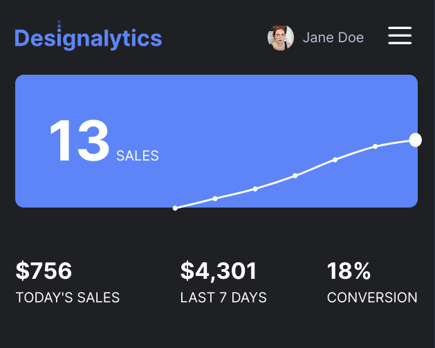
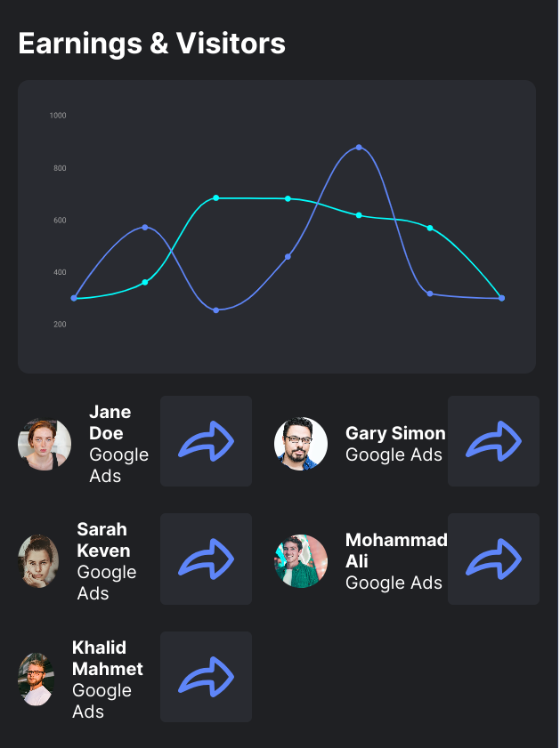
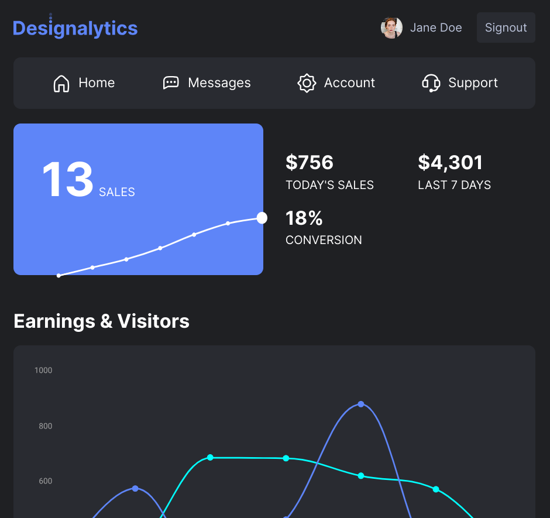
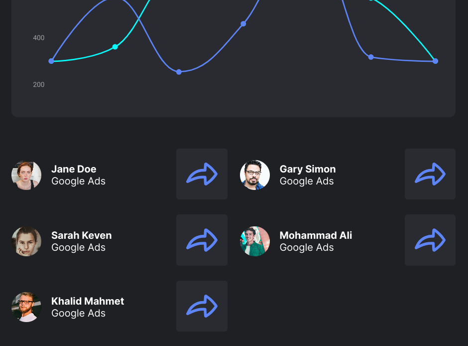
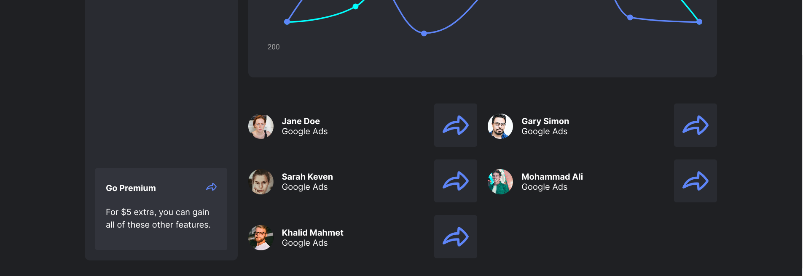

# Designalytics Web Project

A wonderful CSS and HTML project which made by SCSS and HTML5. This design is wonderful for sale projects
and you can use for your projects.

## Screenshots

***1. Mobile***

***2. Tablet***

***3. Desktop***

------

## Languages and Tools are used 🗣️🔧

1. **Languages** 🗣️

    + [HTML](https://github.com/topics/html)
    + [HTML5](https://github.com/topics/html5)
    + [CSS](https://github.com/topics/css)
    + [CSS3](https://github.com/topics/css3)
    + [SCSS](https://github.com/topics/scss)

2. **Tools** 🔧
    + [Chrome](https://github.com/topics/chrome)
    + [Figma](https://github.com/topics/figma)
    + [VSCode](https://github.com/topics/vscode)
    + [Netlify](https://github.com/topics/netlify)

## Deployment 📥

1. How to deploy our project to the ***Netlify*** site?
2. I use [Netlify App](https://app.netlify.com/) for deploying my projects.
3. Go to the Netlify site and select Add a new site.
4. From there select **_Deploy with Github_**.
